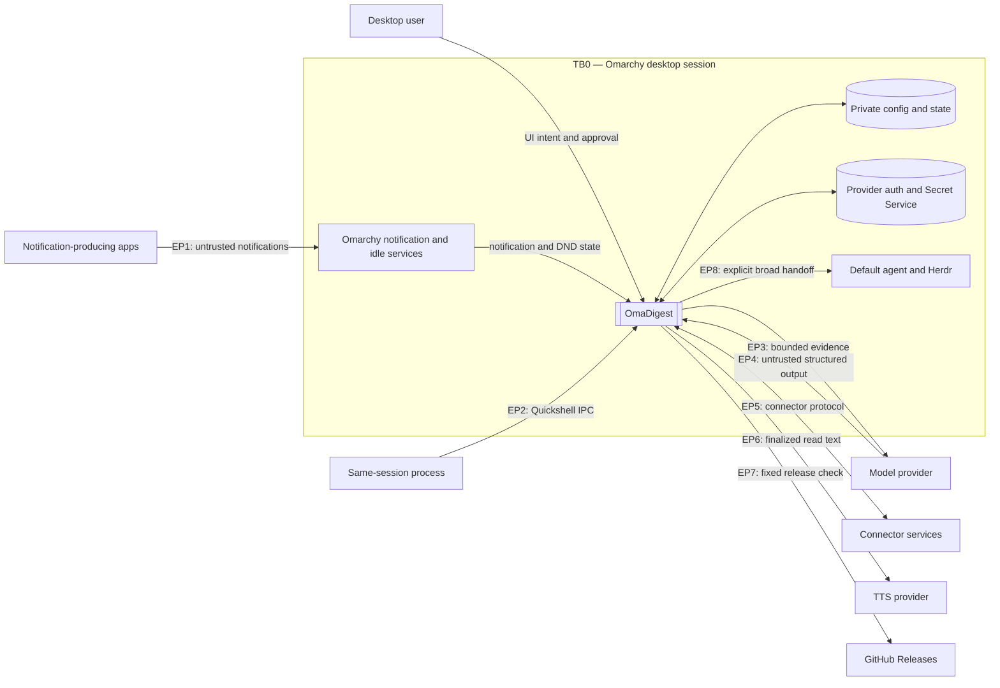
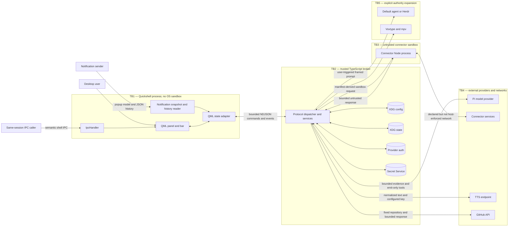
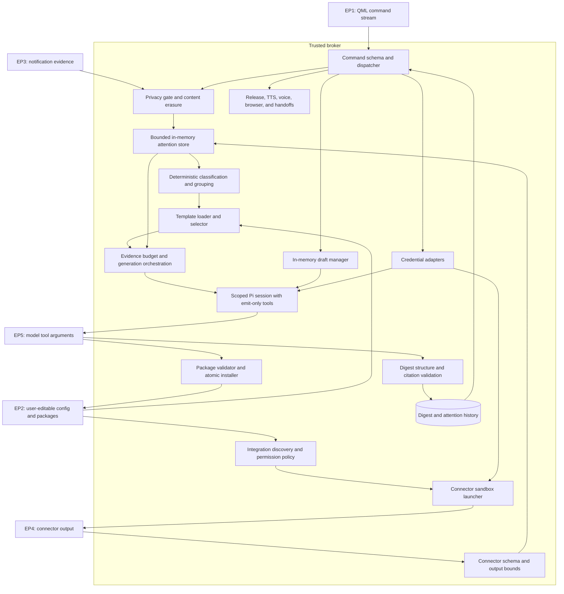

# Threat model

**Review date:** 2026-08-21  
**Reviewed implementation:** `d238b8576c9ffa8e707a54b18e3341bd72fd8851`  
**Method:** architecture decomposition, STRIDE, white-box source review, and
isolated black-box boundary tests

## Scope

### Assets

- **A1 — private evidence:** notification and connector titles, bodies, source
  IDs, timestamps, and application names.
- **A2 — derived work:** digests, templates, routing policy, draft packages,
  and template suggestions.
- **A3 — credentials:** model authentication, integration secrets, GitHub CLI
  authority, and TTS API keys.
- **A4 — policy and state:** privacy rules, source enablement, category choices,
  acknowledgements, and retained history.
- **A5 — delegated authority:** connector subprocess permissions, default-agent
  and Herdr handoffs, browser launches, voice capture, and playback.
- **A6 — availability and budget:** the Quickshell process, broker, storage,
  provider quotas, and desktop responsiveness.

### Threat actors and entry points

- A malicious or compromised notification-producing application.
- Prompt-injection content in notification or connector evidence.
- A malicious generated, modified, or manually installed connector/template.
- A compromised model/provider or adversarial structured model output.
- A same-session local process invoking Quickshell IPC.
- A local process or user modifying persisted packages and state.
- A malicious or compromised remote connector, model, TTS, or release service.
- A compromised dependency or release artifact.

The broker and checked-in plugin code are trusted application code. Model
output, notification fields, connector code/results, persisted user-editable
packages, remote responses, authentication messages, and every UI-bound string
are untrusted. The desktop user is trusted to approve actions, but unrelated
same-UID processes should not automatically inherit every OmaDigest action.

### Out of scope

- Compromise of the kernel, Omarchy, Quickshell, Node.js, Bubblewrap, or Secret
  Service.
- Confidentiality from a process that already has unrestricted access to the
  user's files and unlocked Secret Service collection.
- Security of model-provider infrastructure.
- Semantic correctness of summaries beyond OmaDigest's structural and citation
  checks.

## L0 — system context

## L1 — containers and trust boundaries

## L2 — broker components and data flow

## Existing controls

- Strict discriminated broker commands bound request fields and reject unknown
  shapes.
- Notification privacy runs before persistence. Count-only erases content, and
  protected applications default to Ignore.
- Contentless evidence is rejected again before model generation and cannot be
  cited or handed off.
- Template selection, classification, grouping, and connector selection remain
  deterministic TypeScript decisions.
- Model sessions receive bounded evidence and emit-only structured tools; they
  receive no shell, filesystem, browser, or general coding tools.
- Digest validation constrains sections, entry counts, grouping, titles, and
  citations to supplied evidence IDs.
- Integration discovery and installation reject malformed schemas, unsafe
  paths, symlinks in validated packages, excessive nesting, and excessive file
  or package sizes.
- Connectors are disabled by default, run in Bubblewrap with private HOME and
  temporary storage, and have time and response bounds.
- State uses bounded collections, private permissions, retention limits, and
  mostly atomic writes.
- TTS and integration secrets use Secret Service; provider auth stays in a
  private configuration file and does not cross QML.
- Release checks use one compiled-in repository, no redirects, stable semantic
  versions, a 5-second timeout, and 64-KiB response/cache bounds.
- QML now renders all local `Text` and `TextArea` surfaces as plain text. A
  regression test covers packaged QML, and generated action labels do not
  control setup authority.

## Trust-boundary register

| Boundary | Crossing | Required trust decision | Current enforcement and gap |
|---|---|---|---|
| TB0 — desktop session | Apps and same-session processes into OmaDigest | Notification evidence must not acquire UI, model, or action authority; local IPC must not imply unrestricted user intent. | Privacy and plain-text rendering constrain evidence. Sender identity and mutating IPC still need stronger authority checks (TM-05, TM-06). |
| TB1 — QML to broker | NDJSON commands, events, and snapshots | QML may request typed product operations, but must not perform filesystem, network, connector, or model work itself. | Broker command schemas are strict. Notification history remains an unbounded QML-side filesystem/process path (TM-04), and raw protocol lines need a byte cap (TM-09). |
| TB2 — broker to model | Bounded notification/connector evidence and structured tool results | Evidence is data, never instructions; model output cannot select tools or cite material outside the supplied set. | Scoped emit-only Pi tools, evidence budgets, deterministic routing, and citation checks enforce the main boundary. The general-agent handoff prompt remains an authority-escalation gap (TM-08, TM-16). |
| TB3 — broker to connector | Manifest, config, secrets, subprocess authority, network, and response envelope | Installed connector code should receive only its declared, user-approved capability and return bounded opaque evidence. | Package/response/time validation works, but host and command declarations are not enforced as fine-grained capabilities (TM-02, TM-03, TM-19). |
| TB4 — broker to persistence | Notifications, digests, templates, policies, setup values, and credentials | Sensitive content must remain private, bounded, schema-valid, and deletable under tightened policy. | Private permissions, Secret Service, retention, and mostly atomic writes exist. Segment bytes, nested digest reload, config projection, and orphan-secret cleanup remain incomplete (TM-07, TM-11, TM-14, TM-15). |
| TB5 — broker to remote services | Model evidence, connector requests, TTS text, and release checks | Each service receives only the minimum intended data under bounded time and response size. | Model/release inputs are bounded and release routing is fixed. Connector egress is broad and TTS buffers before enforcing its cap (TM-02, TM-13, TM-21). |
| TB6 — explicit broad handoff | User-approved prompt to the default agent or Herdr | The user must see and approve the exact authority-expanding request. | Handoffs require a gesture, but one suggested prompt is model-controlled and hidden, and prompt data appears in process arguments (TM-08, TM-16). |

## White-box source review

The source review followed untrusted strings from notification, connector,
model, persistence, authentication, error, and IPC sources to QML, model,
filesystem, network, subprocess, credential, browser, and media sinks. It also
compared every collection and protocol boundary with its documented item,
byte, time, and retention limits.

| Review area | Result |
|---|---|
| QML text and action sinks | The original markup/resource-loading path was confirmed and fixed across 112 `Text` elements and four `TextArea` elements. Dynamic integration toggles now use a local safe component; action authority no longer derives from a manifest label. |
| Notification privacy and prompt-injection handling | Privacy erasure occurs before persistence and model use; contentless evidence is rejected again at generation. App-string identity spoofing remains open. |
| Model and template authority | Digest/template sessions expose only bounded emit tools and deterministic routing remains outside the model. A hidden model-generated broad-agent handoff prompt remains open. |
| Filesystem and retention | Package validation, private permissions, retention, and atomic installation are substantial controls. Attention segment bytes, nested persisted-digest validation, some symlink paths, and config-file bytes need hardening. |
| Connector sandbox and credentials | Time, response, package, and protocol-type bounds fail closed. Network and declared command capability are broader than the manifest implies; this was independently reproduced in isolated black-box tests. |
| Auxiliary network/process features | Release checking is narrowly fixed and bounded. TTS streaming, OAuth host restriction, prompt transport, IPC gating, and content-free auditing remain backlog items. |

## STRIDE assessment

Priority combines exploit preconditions and impact: **P0** blocks release;
**P1** should be addressed before treating the affected feature as a strong
security boundary; **P2** is a planned hardening item.

The white-box review traced every external string and persisted object through
validation, storage, model, process, and UI sinks; inventoried filesystem,
network, subprocess, credential, and IPC authority; and compared actual bounds
with the documented contracts. No critical issue was found. TM-01 was the sole
release-blocking issue and is fixed; the open high-impact findings below require
additional preconditions such as an accepted connector or same-session caller.

| ID | STRIDE | Status | Priority | Scenario and evidence | Recommended treatment |
|---|---|---:|---:|---|---|
| TM-01 | S, I, D | Fixed in `d238b85` | P0 | Model, connector, auth, error, and persisted strings reached QML `Text` in `AutoText`, allowing markup interpretation and resource loads. | Every local `Text`/`TextArea` is explicitly plain text; generated integration toggles use a local safe control; regression tests enforce the boundary. |
| TM-02 | I, E | Open, confirmed | P1 | `permissions.networkHosts` enables `--share-net` and bare `--allow-net`; it is not a host allowlist. An isolated test reached an undeclared localhost endpoint. | Proxy connector HTTP through the broker and enforce scheme, host, port, redirects, response bytes, and time. Until then, describe declarations as requested network capability, not isolation. |
| TM-03 | I, E | Open, confirmed | P1 | Declaring `gh` grants `GH_TOKEN`, `--allow-child-process`, and read-only `/usr`/`/etc` mounts. An isolated user connector launched an undeclared absolute child process and read outside `/integration`. | Deny host commands for user packages. Replace GitHub CLI delegation with a typed, read-only broker service for the audited bundled source. |
| TM-04 | D, I | Open | P1 | `Panel.qml` launches `bash`/`awk` over every Omarchy notification-history file. `StdioCollector` retains all output before the parser keeps 50 rows. | Move history reading into the broker; accept only regular non-symlink files and enforce file-count, per-file, total-byte, row, and time limits before returning normalized items. |
| TM-05 | S, T, I, D | Open | P1 | The production `IpcHandler` exposes model generation, draft acceptance, integration setup/enablement, skill installation, and detailed state to same-session callers. | Keep navigation/status IPC public. Require an opt-in demo capability or visible confirmation for mutations, rate-limit model work, and slice arguments at IPC entry. |
| TM-06 | S, I | Open | P1 | Notification privacy keys only on the sender-provided `app` string, which another local notifier can spoof to inherit an allow rule. | Prefer a service-owned desktop-entry/sender identity. Treat missing or mismatched identities as count-only and display the identity used by each rule. |
| TM-07 | T, D, I | Open | P1 | Attention ingest appends duplicate IDs on every snapshot and has no segment byte ceiling; later policy rewrites skip segments over 10 MiB. | Append only new/changed records, rotate before a hard segment limit, enforce a total disk budget, and delete or quarantine oversized segments during policy tightening. |
| TM-08 | T, E | Open | P1 | A model-created `out_of_scope.suggestedPrompt` is not shown in the draft review but is passed to the general default agent after one click. | Remove model authority over the prompt, derive it from the user's original request in broker code, show the exact bounded prompt, and require confirmation before authority expansion. |
| TM-09 | D | Open | P2 | Broker stdin is parsed only after a complete newline is buffered. A multi-megabyte malformed line was rejected and the process recovered, but still consumed memory first. | Add a byte-limited line reader and terminate/reset the broker child on a protocol-line violation. |
| TM-10 | T, D | Open | P2 | Model calls occupy the broker's sequential command loop for up to several minutes, delaying cancellation, shutdown, and unrelated actions. | Use a bounded cancellable job manager and permit status/cancel commands while one generation or draft is active. |
| TM-11 | T, D | Open | P2 | Persisted digest reload validates only top-level fields and entry-array presence, not the complete nested bounded digest schema. | Reuse one strict digest schema for model output, persistence, broker events, and QML snapshots; reject or quarantine malformed records. |
| TM-12 | T, E | Open | P2 | Template loading follows `SKILL.md` and compiled-file symlinks; destructive config operations rely mainly on lexical containment. | Use `lstat`/regular-file checks for every package file and verify non-symlink roots before destructive operations. |
| TM-13 | D, I | Open | P2 | TTS calls `response.arrayBuffer()` before enforcing the 50-MiB audio limit, allowing a configured or compromised endpoint to pressure memory. | Reject excessive `Content-Length` and stream into a private file with an incremental byte cap and abort. |
| TM-14 | D, T | Open | P2 | Integration setup JSON is read without a file-size bound and retains undeclared primitive keys from tampered configuration. | Bound bytes before parsing and project values through the manifest's declared field keys and types. |
| TM-15 | I | Open | P2 | Integration deletion clears secrets only for currently discoverable valid packages; corrupt or already removed packages may leave keyring items behind. | Maintain a bounded secret index at write time and clear by indexed integration/field IDs independently of package discovery. |
| TM-16 | I, E | Open | P2 | Default-agent and Herdr handoffs intentionally expand authority; evidence-bearing prompts travel in process arguments and may be visible to same-user process inspection. | Keep the explicit gesture, add a final preview, and pass content over private stdin or a mode-`0600` temporary file. |
| TM-17 | S, I | Open | P2 | OAuth/browser launch accepts any credential-free HTTP or HTTPS URL supplied by a compiled provider flow. | Add provider-specific HTTPS host allowlists and explicit loopback HTTP exceptions only where required. |
| TM-18 | R | Open | P2 | Policy changes, source changes, draft acceptance, deletion, credential changes, and handoffs lack a bounded durable audit record. | Add a content-free rotating audit log containing timestamp, action type, object ID, outcome, and stable error code. Never log evidence or credentials. |
| TM-19 | S, T | Open | P2 | Connector responses are not required to match the request ID or protocol version, and nonzero exit/trailing output is not rejected after a parseable first line. | Strictly validate one response envelope, matching ID/version, clean exit, and absence of extra protocol output. |
| TM-20 | T, E | Residual | — | The plugin executes in the long-running Quickshell process with desktop-user authority; dependency or release compromise has high impact. | Retain reproducible checked-in bundles, lockfile/audit review, source maps, marketplace scanning, signed release practice, and minimal QML authority. |
| TM-21 | I | Residual | — | Remote model and configured TTS use deliberately disclose selected evidence or digest text to those providers. | Keep separate explicit configuration and show the active provider/endpoint before first use. |

### Defense-in-depth backlog

- Snapshot validated connector packages before execution to close the
  discovery-to-bind replacement window.
- Treat a first connector probe as code execution, not a harmless status read,
  and require an explicit trust decision before providing secrets.
- Bound privacy-rule and template-directory item counts in addition to their
  existing per-field/file limits.
- Strengthen the textual QML regression test with a QML-aware lint rule so
  alternate declaration formatting cannot bypass it.
- Validate media type and consider sandboxing `mpv`, which parses
  provider-controlled audio.

## Black-box boundary tests

Tests used isolated temporary XDG/config/state roots and local fixtures. They did
not read live OmaDigest data or secrets and made no non-local network requests.

| Boundary | Result | Observation |
|---|---:|---|
| Malformed multi-megabyte broker command followed by a valid command | Pass with TM-09 caveat | Invalid input was rejected and the broker recovered for the next command. |
| Markup-shaped connector status/evidence | Pass after TM-01 | Broker preserved it as bounded opaque data; QML now renders it as plain text. |
| Invalid JSON, missing, oversized, or slow connector response | Pass | Calls failed closed; the 64-KiB response and 20-second execution bounds were enforced. |
| Traversal, ID mismatch, symlink, and oversized manifest packages | Pass | Packages remained undiscoverable or failed validation. |
| Unsupported declared command | Pass | The runtime rejected it before connector execution. |
| Declared network-host isolation | **Fail** | A connector reached a local endpoint not named in its declaration; see TM-02. |
| Declared command isolation | **Fail** | A connector with the supported command capability launched an undeclared absolute child and read host-mounted system evidence; see TM-03. |
| Unknown-app and protected-app privacy | Pass | Unknown content was erased; protected content was dropped before persistence/model use. |
| Count-only model exclusion | Pass | Contentless evidence could not trigger a digest model call or citation. |
| Adversarial sequence resilience | Pass | The broker remained responsive and shut down cleanly. |

Existing deterministic tests, not counted as new black-box evidence, also cover
citation reuse/grouping, malformed and oversized release responses, package
installation rollback, connector categories, and privacy-policy tightening.

## Prioritized remediation

Before claiming connector or same-session IPC isolation:

1. Replace raw connector networking and GitHub CLI delegation with typed broker
   services; immediately deny host commands for user-authored packages.
2. Move notification-history access into a bounded broker service.
3. Gate mutating/costful IPC behind a demo capability or visible confirmation.
4. Remove model control of the hidden default-agent handoff prompt and show the
   exact prompt before launch.
5. Bind privacy decisions to service-owned sender identity where Omarchy exposes
   one.
6. Add attention-segment disk budgets and raw broker-line bounds.

Next hardening cycle:

1. Make model jobs cancellable without blocking status/shutdown.
2. Apply strict schemas to persisted digests and setup values.
3. Complete symlink/no-follow checks for templates and destructive roots.
4. Stream TTS responses under an incremental cap.
5. Make broad-agent handoffs fully previewable and keep prompt data out of argv.
6. Add a bounded, content-free security audit log.

## Residual risk

Even after the planned mitigations:

- Quickshell plugins execute with the desktop user's authority.
- A process already controlling the same UID may read private state or request
  unlocked Secret Service items.
- Selected evidence leaves the machine when the user chooses a remote model;
  finalized digest text leaves when read mode uses a remote TTS endpoint.
- Model output can be structurally valid and cited while still being wrong.
- Default-agent and Herdr handoffs intentionally have much broader authority
  than the scoped Pi sessions.
- Connector host isolation remains incomplete until all outbound access is
  mediated by an enforcing broker boundary.

## Review triggers

Repeat this exercise when adding a provider, connector permission, persisted
data type, IPC method, general-agent handoff, QML rendering primitive, or new
network/filesystem/process capability. Re-run the isolated black-box matrix for
every sandbox or broker protocol change.
