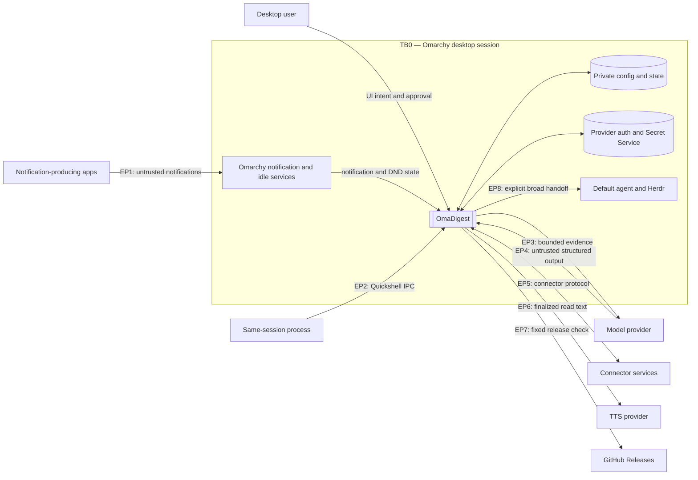
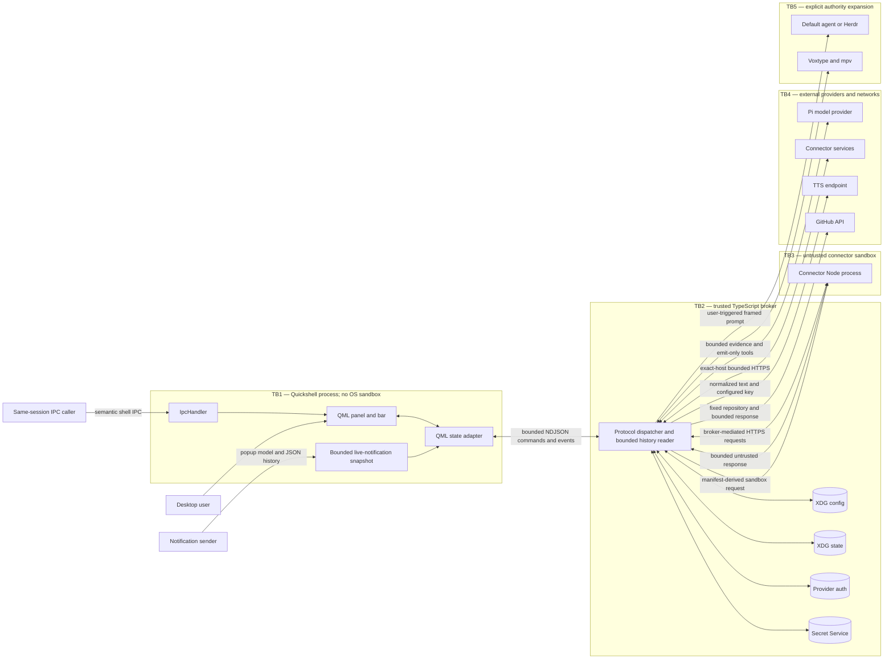
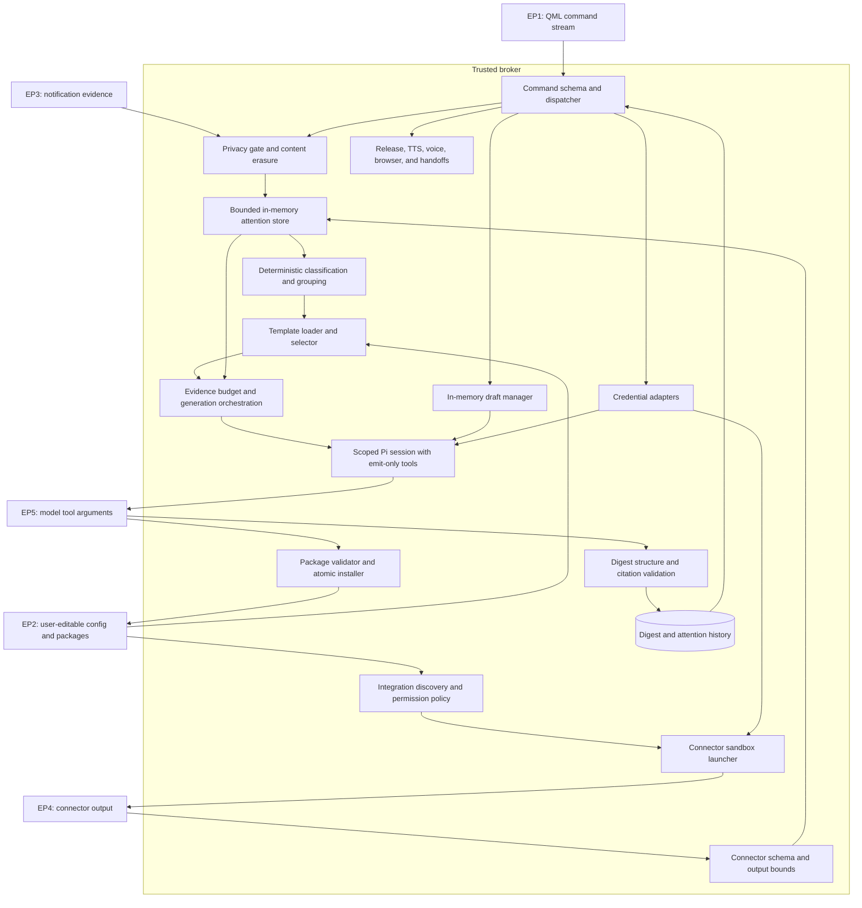

# Threat model

**Review date:** 2026-08-23

**Reviewed implementation:** current `main`

**Method:** architecture decomposition, STRIDE, white-box source review, and
isolated black-box boundary tests

## Scope

### Assets

- **A1 — private evidence:** notification and connector titles, bodies, source
  IDs, timestamps, and application names.
- **A2 — derived work:** digests, templates, routing policy, draft packages,
  and template suggestions.
- **A3 — credentials:** model authentication, integration secrets, GitHub CLI
  authority, and TTS API keys.
- **A4 — policy and state:** privacy and standing attention policy, source enablement, category choices,
  acknowledgements, outcome feedback, and retained history.
- **A5 — delegated authority:** connector subprocess permissions, default-agent
  and Herdr handoffs, browser launches, voice capture, and playback.
- **A6 — availability and budget:** the Quickshell process, broker, storage,
  provider quotas, and desktop responsiveness.

### Threat actors and entry points

- A malicious or compromised notification-producing application.
- Prompt-injection content in notification or connector evidence.
- A malicious generated, modified, or manually installed connector/template.
- A compromised model/provider or adversarial structured model output.
- A same-session local process invoking Quickshell IPC.
- A local process or user modifying persisted packages and state.
- A malicious or compromised remote connector, model, TTS, or release service.
- A compromised dependency or release artifact.

The broker and checked-in plugin code are trusted application code. Model
output, notification fields, connector code/results, persisted user-editable
packages, remote responses, authentication messages, and every UI-bound string
are untrusted. The desktop user is trusted to approve actions, but unrelated
same-UID processes should not automatically inherit every OmaDigest action.

### Out of scope

- Compromise of the kernel, Omarchy, Quickshell, Node.js, Bubblewrap, or Secret
  Service.
- Confidentiality from a process that already has unrestricted access to the
  user's files and unlocked Secret Service collection.
- Security of model-provider infrastructure.
- Semantic correctness of summaries beyond OmaDigest's structural and citation
  checks.

## L0 — system context

## L1 — containers and trust boundaries

## L2 — broker components and data flow

## Existing controls

- Strict discriminated broker commands bound request fields and reject unknown
  shapes.
- Notification privacy runs before persistence. Protected app names default to
  ignore and unknown names default to count-only; individual rules are
  user-facing content filters, not authenticated identities.
- Contentless evidence is rejected again before model generation and cannot be
  cited or handed off.
- Privacy, classification, grouping, source/category enablement, template
  eligibility, action thresholds, timer ownership, and proposal validation
  remain deterministic TypeScript decisions. The model may choose only among
  the action variants and eligible templates the broker supplies.
- Model sessions receive bounded evidence and emit-only structured tools; they
  receive no shell, filesystem, browser, or general coding tools.
- Digest validation constrains sections, entry counts, grouping, titles, and
  citations to supplied evidence IDs.
- Integration discovery and installation reject malformed schemas, unsafe
  paths, symlinks in validated packages, excessive nesting, and excessive file
  or package sizes.
- Connectors are disabled by default, run in Bubblewrap with private HOME and
  temporary storage, and have time and response bounds.
- State uses bounded collections, private permissions, retention limits, and
  mostly atomic writes.
- TTS and integration secrets use Secret Service; provider auth stays in a
  private configuration file and does not cross QML.
- Release checks use one compiled-in repository, no redirects, stable semantic
  versions, a 5-second timeout, and 64-KiB response/cache bounds.
- QML now renders all local `Text` and `TextArea` surfaces as plain text. A
  regression test covers packaged QML, and generated action labels do not
  control setup authority.

## Trust-boundary register

| Boundary | Crossing | Required trust decision | Current enforcement and gap |
|---|---|---|---|
| TB0 — desktop session | Apps and same-session processes into OmaDigest | Notification evidence must not acquire UI, model, or action authority; local IPC must not imply unrestricted user intent. | App-name rules filter content but do not grant tool/action authority. Unknown names default to count-only; production IPC exposes only navigation/content-free status and mutations require explicit demo mode (TM-05 fixed; TM-06 accepted residual). |
| TB1 — QML to broker | NDJSON commands, events, and snapshots | QML may request typed product operations, but must not perform filesystem, network, connector, or model work itself. | Broker command schemas are strict, notification history is broker-read under file/item/byte bounds, and protocol lines are discarded above a 2-MiB pre-parse cap (TM-04/TM-09 fixed). |
| TB2 — broker to model | Bounded notification/connector evidence, progressive-memory nodes, and structured tool results | Evidence and historical summaries are data, never instructions; model output cannot gain tools, schedule itself, or cite material outside the supplied set. | Scoped typed Pi tools, a four-read/48-KiB recall budget, evidence budgets, broker-filtered action variants and template eligibility, conditional-watch leases, current-evidence requirements, and citation checks enforce the main boundary. Out-of-scope prompt authority is broker-owned and broad-agent payloads use one-use broker claims (TM-08/TM-16 fixed). |
| TB3 — broker to connector | Manifest, config, secrets, subprocess authority, network, and response envelope | Installed connector code should receive only its declared, user-approved capability and return bounded opaque evidence. | Connectors have no network/child permission; HTTPS is exact-host broker mediation and commands are rejected. Final responses require matching IDs/versions and clean exit (TM-02/TM-03/TM-19 fixed). |
| TB4 — broker to persistence | Notifications, digests, templates, policies, setup values, and credentials | Sensitive content must remain private, bounded, schema-valid, and deletable under tightened policy. | Private permissions, retention, atomic writes, projected integration config, deduplicated append, and segment/total budgets exist. Nested digest reload and orphan-secret cleanup remain incomplete (TM-07/TM-14 fixed; TM-11/TM-15 open). |
| TB5 — broker to remote services | Model evidence, connector requests, TTS text, and release checks | Each service receives only the minimum intended data under bounded time and response size. | Model/release inputs are bounded, release routing is fixed, connector HTTPS is mediated, and TTS audio streams to a private file under an incremental 50-MiB cap (TM-02/TM-13 fixed; TM-21 residual). |
| TB6 — explicit broad handoff | User-approved prompt to the default agent or Herdr | The user must see and approve the exact authority-expanding request. | The broker derives and previews out-of-scope prompts, consumes a one-use confirmation, and transports all handoff payloads through a private one-use Unix-socket claim. Process arguments carry only a fixed instruction and opaque five-minute capability (TM-08/TM-16 fixed). |

## White-box source review

The source review followed untrusted strings from notification, connector,
model, persistence, authentication, error, and IPC sources to QML, model,
filesystem, network, subprocess, credential, browser, and media sinks. It also
compared every collection and protocol boundary with its documented item,
byte, time, and retention limits.

| Review area | Result |
|---|---|
| QML text and action sinks | The original markup/resource-loading path was confirmed and fixed across 112 `Text` elements and four `TextArea` elements. Dynamic integration toggles now use a local safe component; action authority no longer derives from a manifest label. |
| Notification privacy and prompt-injection handling | Privacy erasure occurs before persistence and model use; contentless evidence is rejected again at generation. Per-app label matching remains a deliberate user-facing filter, while all evidence stays untrusted and receives no action authority. |
| Model and template authority | Attention/digest/template sessions expose only bounded typed tools. The attention model may search or zoom bounded historical nodes, choose among broker-eligible templates, and submit a currently permitted hold/digest/notify variant, while the broker owns memory persistence, watch matching, timers, thresholds, execution, and citations. Out-of-scope prompt text is broker-derived, fully previewed, and confirmed with a one-use token. |
| Filesystem and retention | Package validation, private permissions, retention, atomic installation, config byte/projection checks, and attention disk budgets are substantial controls. Nested persisted-digest validation and some symlink paths still need hardening. |
| Connector sandbox and credentials | Time, response, package, and protocol bounds fail closed. Direct network/child authority was removed; broker HTTPS and fixed read-only GitHub calls now enforce the intended capability boundary. |
| Auxiliary network/process features | Release checking is narrowly fixed and bounded. Production IPC mutations are demo-gated and argument-bounded. TTS responses stream under an incremental cap, and broad-agent payloads use private one-use claims. OAuth host restriction and content-free auditing remain backlog items. |

## STRIDE assessment

Priority combines exploit preconditions and impact: **P0** blocks release;
**P1** should be addressed before treating the affected feature as a strong
security boundary; **P2** is a planned hardening item.

The white-box review traced every external string and persisted object through
validation, storage, model, process, and UI sinks; inventoried filesystem,
network, subprocess, credential, and IPC authority; and compared actual bounds
with the documented contracts. No critical issue was found. The release-blocking
TM-02 through TM-05, TM-07 through TM-09, TM-13, and TM-16 findings are fixed
through the v0.1.4 release candidate. TM-06 is retained as a P2 product limitation; the remaining items
are P2 hardening or explicitly documented residual risks.

| ID | STRIDE | Status | Priority | Scenario and evidence | Recommended treatment |
|---|---|---:|---:|---|---|
| TM-01 | S, I, D | Fixed in `d238b85` | P0 | Model, connector, auth, error, and persisted strings reached QML `Text` in `AutoText`, allowing markup interpretation and resource loads. | Every local `Text`/`TextArea` is explicitly plain text; generated integration toggles use a local safe control; regression tests enforce the boundary. |
| TM-02 | I, E | Fixed in v0.1.3 | P1 | The original sandbox granted process-wide network. Connectors now have no direct network access; bounded HTTPS crosses a broker proxy with exact scheme/host/port, public-address DNS validation, no automatic redirects, and header/method/request/response/time caps. |
| TM-03 | I, E | Fixed in v0.1.3 | P1 | Host commands are rejected by the manifest, runtime, and validator. The bundled GitHub connector receives no token or executable; fixed read-only `gh api` calls run in trusted broker code and pass only bounded data. |
| TM-04 | D, I | Fixed in v0.1.3 | P1 | QML no longer reads history or starts shell processes. The broker reads at most 50 regular non-symlink history files under 64-KiB/file and 512-KiB total limits. |
| TM-05 | S, T, I, D | Fixed in v0.1.3 | P1 | Production IPC exposes navigation plus content-free state. Every costful/mutating demo method checks explicit shell-start demo mode, and request strings are sliced at entry. Demo restore removes the opt-in before restart. |
| TM-06 | S, I | Accepted residual | P2 | Native app labels are sender-provided, so a local notifier can match another app's content rule. This changes handling only for notifications the sender itself creates; it does not reveal another app's evidence or grant tool authority. Unknown names default to count-only, protected names to ignore, and all resulting evidence remains untrusted data. | Keep per-app filtering as a user control, describe it as name matching rather than authentication, and prefer validated integration IDs when a source needs a stronger identity boundary. |
| TM-07 | T, D, I | Fixed in v0.1.3 | P1 | Identical snapshots are not appended; changed IDs replace in memory, segments compact at 2 MiB, total event storage is capped at 8 MiB/seven files, and oversized/unreadable segments are removed during load/policy rewrite. |
| TM-08 | T, E | Fixed in v0.1.3 | P1 | `out_of_scope` no longer accepts a prompt. The broker derives the exact prompt from the original request, displays it in QML, and launches only after consuming a one-use five-minute confirmation token. |
| TM-09 | D | Fixed in v0.1.4 | P2 | A byte-counted NDJSON reader caps each command at 2 MiB before decoding or parsing, discards the remainder of an oversized line without retaining it, emits a content-free error, and recovers at the next newline. |
| TM-10 | T, D | Open | P2 | Model calls occupy the broker's sequential command loop for up to several minutes, delaying cancellation, shutdown, and unrelated actions. | Use a bounded cancellable job manager and permit status/cancel commands while one generation or draft is active. |
| TM-11 | T, D | Open | P2 | Persisted digest reload validates only top-level fields and entry-array presence, not the complete nested bounded digest schema. | Reuse one strict digest schema for model output, persistence, broker events, and QML snapshots; reject or quarantine malformed records. |
| TM-12 | T, E | Open | P2 | Template loading follows `SKILL.md` and compiled-file symlinks; destructive config operations rely mainly on lexical containment. | Use `lstat`/regular-file checks for every package file and verify non-symlink roots before destructive operations. |
| TM-13 | D, I | Fixed in v0.1.4 | P2 | TTS rejects excessive declared lengths and unsupported media types, streams into an exclusive private file under an incremental 50-MiB cap, cancels oversized bodies, and removes partial output on failure. |
| TM-14 | D, T | Fixed in v0.1.3 | P2 | Integration setup JSON is capped at 256 KiB before parsing and projected through declared non-secret keys, field types, string lengths, and URL validation. |
| TM-15 | I | Open | P2 | Integration deletion clears secrets only for currently discoverable valid packages; corrupt or already removed packages may leave keyring items behind. | Maintain a bounded secret index at write time and clear by indexed integration/field IDs independently of package discovery. |
| TM-16 | I, E | Fixed in v0.1.4 | P2 | Default-agent and Herdr argv now contain only a fixed claim instruction and opaque five-minute capability. Summarized digest handoffs omit original notification titles/bodies, and all handoff payloads cross a mode-`0600` Unix socket under an in-memory, one-use claim capped at 160 KiB. |
| TM-17 | S, I | Open | P2 | OAuth/browser launch accepts any credential-free HTTP or HTTPS URL supplied by a compiled provider flow. | Add provider-specific HTTPS host allowlists and explicit loopback HTTP exceptions only where required. |
| TM-18 | R | Open | P2 | Policy changes, source changes, draft acceptance, deletion, credential changes, and handoffs lack a bounded durable audit record. | Add a content-free rotating audit log containing timestamp, action type, object ID, outcome, and stable error code. Never log evidence or credentials. |
| TM-19 | S, T | Fixed in v0.1.3 | P2 | The broker requires one final response with the matching request ID and protocol version, waits for a clean connector exit, and rejects duplicate or trailing final responses. |
| TM-20 | T, E | Residual | — | The plugin executes in the long-running Quickshell process with desktop-user authority; dependency or release compromise has high impact. | Retain reproducible checked-in bundles, lockfile/audit review, source maps, marketplace scanning, signed release practice, and minimal QML authority. |
| TM-21 | I | Residual | — | Remote model and configured TTS use deliberately disclose selected evidence or digest text to those providers. | Keep separate explicit configuration and show the active provider/endpoint before first use. |

### Defense-in-depth backlog

- Snapshot validated connector packages before execution to close the
  discovery-to-bind replacement window.
- Treat a first connector probe as code execution, not a harmless status read,
  and require an explicit trust decision before providing secrets.
- Bound template-directory item counts in addition to the existing
  per-field/file limits.
- Strengthen the textual QML regression test with a QML-aware lint rule so
  alternate declaration formatting cannot bypass it.
- Validate media type and consider sandboxing `mpv`, which parses
  provider-controlled audio.

## Black-box boundary tests

Tests used isolated temporary XDG/config/state roots and local fixtures. They did
not read live OmaDigest data or secrets and made no non-local network requests.

| Boundary | Result | Observation |
|---|---:|---|
| Malformed multi-megabyte broker command followed by a valid command | Pass after TM-09 | Input was discarded at the 2-MiB pre-parse cap without retaining the remainder, and the broker recovered for the next command. |
| Markup-shaped connector status/evidence | Pass after TM-01 | Broker preserved it as bounded opaque data; QML now renders it as plain text. |
| Invalid JSON, missing, oversized, or slow connector response | Pass | Calls failed closed; the 64-KiB response and 20-second execution bounds were enforced. |
| Traversal, ID mismatch, symlink, and oversized manifest packages | Pass | Packages remained undiscoverable or failed validation. |
| Unsupported declared command | Pass | The runtime rejected it before connector execution. |
| Declared network-host isolation | Pass after TM-02 | Connectors have no direct network namespace; broker mediation rejected undeclared and private endpoints while enforcing exact declared HTTPS hosts. |
| Declared command isolation | Pass after TM-03 | Manifests cannot request commands, and connector sandboxes have no child-process permission or usable executable path. |
| Native-notification privacy | Pass with TM-06 caveat | Unknown content was erased, protected app content was dropped, and only explicitly permitted names became model-eligible; app-name matching is not sender authentication. |
| Count-only model exclusion | Pass | Contentless evidence could not trigger a digest model call or citation. |
| Adversarial sequence resilience | Pass | The broker remained responsive and shut down cleanly. |

Existing unit tests, not counted as new black-box evidence, also cover
citation reuse/grouping, malformed and oversized release responses, package
installation rollback, connector categories, and privacy-policy tightening.

## Prioritized remediation

The connector, history, IPC, handoff, attention-retention, protocol-line, and
TTS response findings were addressed through v0.1.4. The next hardening cycle is:

1. Make model jobs cancellable without blocking status/shutdown.
2. Apply strict schemas to persisted digests.
3. Complete symlink/no-follow checks for templates and destructive roots.
4. Add a bounded, content-free security audit log.

## Residual risk

Even after the planned mitigations:

- Quickshell plugins execute with the desktop user's authority.
- A process already controlling the same UID may read private state or request
  unlocked Secret Service items.
- Selected evidence leaves the machine when the user chooses a remote model;
  finalized digest text leaves when read mode uses a remote TTS endpoint.
- Model output can be structurally valid and cited while still being wrong.
- Default-agent and Herdr handoffs intentionally have much broader authority
  than the scoped Pi sessions.
- Connectors depend on the broker's HTTPS proxy and the local resolver for
  hostname enforcement; DNS rebinding and resolver behavior remain review
  triggers for changes to that boundary.

## Review triggers

Repeat this exercise when adding a provider, connector permission, persisted
data type, IPC method, general-agent handoff, QML rendering primitive, or new
network/filesystem/process capability. Re-run the isolated black-box matrix for
every sandbox or broker protocol change.
